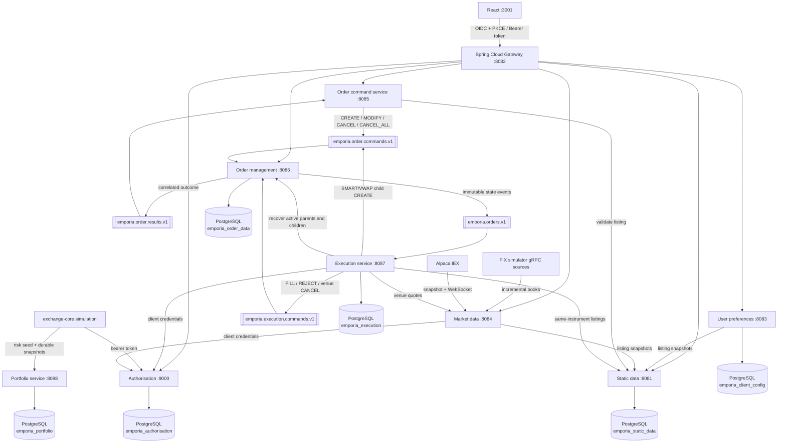

# Emporia Trading Platform

[](https://github.com/nvxtien/emporia/wiki)
[](https://github.com/nvxtien/emporia/wiki/Testing-and-Verification)
[](https://github.com/nvxtien/emporia)
[](https://github.com/nvxtien/emporia)
[](https://github.com/nvxtien/emporia)

> 📖 **Comprehensive Platform Documentation & Architectural Specifications are published on the [Emporia GitHub Wiki](https://github.com/nvxtien/emporia/wiki)!**

Emporia is an enterprise-grade, distributed stock trading platform built with **Java 21**, **Spring Boot 4.0.7**, **React 19**, **Apache Kafka**, **gRPC**, and **PostgreSQL**. Its deployable boundaries strictly follow business capabilities: static data, user preferences, market data, order command handling, and order management are independent services, with execution routing isolated behind its own service.

---

## 📚 Documentation & GitHub Wiki

For in-depth architectural guides, domain design patterns, microservice deep dives, and trading business logic formulas, explore the **[Emporia GitHub Wiki](https://github.com/nvxtien/emporia/wiki)**:

| Section | Description |
|---|---|
| 📖 **[Trading Terminology Glossary](https://github.com/nvxtien/emporia/wiki/Trading-Terminology-Glossary)** | Financial terms: Order types (Limit, Market, Stop, TIF), BBO/NBBO, SOR, VWAP, P&L. |
| 📐 **[Architecture & Order Flow](https://github.com/nvxtien/emporia/wiki/Architecture-and-Order-Flow)** | System architecture flow, port matrix, REST vs. Kafka EDA, database ownership. |
| 📨 **[Order Command Service](https://github.com/nvxtien/emporia/wiki/Order-Command-Service)** | REST intake, listing snapshot validation, `KafkaCommandGateway` result correlation. |
| ⚙️ **[Order Management Service](https://github.com/nvxtien/emporia/wiki/Order-Management-Service)** | State machine authority, `OrderCommandHandler`, `ExecutionCommandHandler`, idempotency. |
| 🎯 **[Execution Service](https://github.com/nvxtien/emporia/wiki/Execution-Service)** | Algorithmic routing (`DMA`, `SMART` NBBO selector, `VWAP` slicer), venue gateways. |
| 📜 **[Order Lifecycle & Invariants](https://github.com/nvxtien/emporia/wiki/Business-Logic-Order-Lifecycle)** | State machine invariants, tick/lot size checks, late fill accounting. |
| 🧠 **[Order Routing & Execution](https://github.com/nvxtien/emporia/wiki/Business-Logic-Order-Routing-and-Execution)** | Smart Order Routing (SOR) venue splitting & VWAP time-slicing logic. |
| 📊 **[Market Data & Pricing](https://github.com/nvxtien/emporia/wiki/Business-Logic-Market-Data-and-Pricing)** | L1/L2 order books, Price-Time priority matching, micro-price formulas. |
| 💼 **[Portfolio & Risk Controls](https://github.com/nvxtien/emporia/wiki/Business-Logic-Portfolio-and-Risk-Management)** | Long/short positions, cost basis, Mark-to-Market P&L, fat-finger price collars. |
| 🧩 **[Design Patterns Catalog](https://github.com/nvxtien/emporia/wiki/Design-Patterns)** | CQRS, Event-Driven Architecture, Saga, Strategy, State Machine patterns. |
| 📦 **[Microservices Overview](https://github.com/nvxtien/emporia/wiki/Microservices-Overview)** | Deep-dive into all 9 microservices, Gateway, and OAuth2 Authorization. |
| ⚡ **[Exchange-Core Integration](https://github.com/nvxtien/emporia/wiki/Exchange-Core-Integration)** | Ultra-low latency LMAX Disruptor ring-buffer matching engine integration. |
| 🧪 **[Testing & Verification](https://github.com/nvxtien/emporia/wiki/Testing-and-Verification)** | 91.95% JaCoCo coverage, Testcontainers PostgreSQL specs, Fray concurrency tests. |
| 🛠️ **[Deployment & Operations](https://github.com/nvxtien/emporia/wiki/Deployment-and-Operations)** | Environment prerequisites, Docker Compose, Maven builds, React UI startup. |

---

## Architecture



The browser sees one `/api` surface. The gateway routes requests by path and
HTTP method to the service that owns each business capability.

## Service ownership

| Directory | Port | Owns |
|---|---:|---|
| `authorisation-service` | 9000 | OAuth2/OIDC login, users, tokens |
| `static-data-service` | 8081 | Instruments and exchange listings |
| `user-preferences-service` | 8083 | Per-user watchlists and persisted workspace layouts |
| `market-data-service` | 8084 HTTP / 50551 gRPC | Simulated, Alpaca IEX, or FIX-simulator market data; venue/composite books; REST, SSE, and gRPC distribution |
| `order-command-service` | 8085 | Authenticated create, modify, cancel, and cancel-all command boundary |
| `order-management-service` | 8086 | Order lifecycle, state, history, executions, and command idempotency |
| `execution-service` | 8087 internal | DMA venue access, best-venue SMART routing, scheduled VWAP child orders, and execution reports |
| `portfolio-service` | 8088 internal | Fully funded cash/equity balances and idempotent exchange snapshot receipts |
| `gateway` | 8082 | Browser security boundary and routing |
| `frontend` | 3001 | React trading workspace |
| `trading-contracts` | not deployed | Versioned Java/Kafka contracts shared at build time |
| `fix-simulator-contracts` | not deployed | Generated FIX-simulator protobuf/gRPC contracts, consumed by `market-data-service` |

No running service reads or writes another Emporia service's PostgreSQL database
or schema.
When a service needs listing data, it calls `static-data-service` and forwards
a bearer token. Orders store an immutable listing snapshot instead of a
cross-schema foreign key.

## Kafka order flow

1. `order-command-service` creates a versioned command with a unique
   `commandId` and publishes it to `emporia.order.commands.v1`.
2. `order-management-service` consumes the command, validates the transition, and
   updates its PostgreSQL projection in a transaction.
3. The command result is stored in `processed_order_command`. A redelivered Kafka
   command therefore returns the same result instead of applying the change twice.
4. `order-management-service` publishes the state transition to `emporia.orders.v1`
   and a correlated response to `emporia.order.results.v1`.
5. `order-command-service` completes the waiting browser request. If Kafka or
   the order processor does not answer within eight seconds, it returns a
   timeout or service error rather than pretending the order succeeded.

Commands are keyed by order ID (or user subject for cancel-all). The six Kafka
partitions can process independent orders in parallel while maintaining the order
of commands for one key.

## Execution flow

- DMA sends the order directly to the configured venue gateway. Local development
  uses a deterministic delayed-fill gateway.
- SMART loads every listing for the instrument and walks executable
  opposite-side depth in price/time order. It creates deterministic DMA children
  across venues, observes the parent limit, and waits/retries when liquidity is
  temporarily unavailable.
- VWAP supports absolute start/end seconds and a configurable bucket count. It
  emits increment-aligned catch-up children from the persisted cumulative target,
  parent fills, and active child exposure.
- Child partial and final fills roll up to every parent ancestor atomically with
  weighted-average fill accounting.
- Cancellation is venue-confirmed. A command records a pending
  `targetStatus=CANCELLED`; the venue acknowledgement finalizes it, while a
  racing execution remains valid.
- `EXECUTION_VENUE_MODE=fix` enables the built-in FIXT 1.1 / FIX 5.0 SP2 source
  adapter for new, modify, cancel, and execution-report messages.
- New execution consumers start at the latest order event, so introducing the
  service cannot accidentally execute retained historical orders.
- On restart, execution rebuilds direct-order and SMART/VWAP runtimes from the
  order-management PostgreSQL projection rather than replaying creates.

See the [DMA, SMART, and VWAP execution guide](docs/execution/README.md) for
strategy behavior, order examples, cancellation, recovery, and current
boundaries. Service-level configuration is collected in
[execution-service/README.md](execution-service/README.md).

## Local prerequisites

- Java 21 or newer
- Maven 3.9+
- Node.js and npm
- PostgreSQL running at `localhost:5432` for non-Docker local runs
- Docker with Compose for Docker-managed infrastructure or full-stack deployment
- **Exchange-Core Engine**: Clone and install [`exchange-core`](https://github.com/nvxtien/exchange-core) (`mvn clean install`) into your local Maven repository before building Emporia.

Non-Docker local PostgreSQL settings:

- Database: `emporia`
- Username: `postgres`
- Password: `admin123`

Flyway creates these service-owned schemas in the local `emporia` database:
`emporia_authorisation`, `emporia_static_data`, `emporia_client_config`,
`emporia_order_data`, `emporia_execution`, and `emporia_portfolio`.

## Run modes

| Mode | Spring services run in | PostgreSQL runs in | PostgreSQL layout |
|---|---|---|---|
| Local | Host JVM | Local PostgreSQL on `localhost:5432` | One `emporia` database with service-owned schemas |
| Infrastructure-only Docker | Host JVM | Docker containers exposed on `5433`-`5438` | One PostgreSQL database/container per service that owns persistent data |
| Full Docker | Docker containers | Docker containers | One PostgreSQL database/container per service that owns persistent data |

## Start locally

Run all commands from the repository root. Keep each long-running Maven or npm
command in its own terminal.

1. Clone and install the `exchange-core` dependency into your local Maven repository:

   ```bash
   git clone https://github.com/nvxtien/exchange-core.git
   cd exchange-core
   mvn clean install
   ```

2. Confirm the shared local PostgreSQL database is running, then start Kafka:

   The non-Docker local path uses one PostgreSQL database at
   `localhost:5432/emporia`; Flyway creates the service-owned schemas when the
   services start. Use the Docker deployment section below if you want
   Docker-managed PostgreSQL instances.

   ```bash
   docker compose up -d kafka
   docker compose ps kafka
   ```

3. Build and install the shared Kafka contract and all split services:

   ```bash
   mvn -f emporia/pom.xml install
   ```

4. Start the authorisation service:

   ```bash
   cd emporia/authorisation-service
   SERVER_PORT=9000 \
   AUTH_ISSUER=http://localhost:3001 \
   OAUTH_REDIRECT_URI=http://localhost:3001/auth/callback \
   OAUTH_POST_LOGOUT_REDIRECT_URI=http://localhost:3001/auth/logout-callback \
   BOOTSTRAP_ADMIN_ENABLED=true \
   BOOTSTRAP_ADMIN_USERNAME=admin \
   BOOTSTRAP_ADMIN_EMAIL=admin@localhost \
   BOOTSTRAP_ADMIN_PASSWORD=admin123 \
   BOOTSTRAP_ADMIN_DESK=default \
   BOOTSTRAP_ADMIN_CAN_TRADE=true \
   DB_PASSWORD=admin123 \
   mvn spring-boot:run
   ```

4. Start the seven trading microservices, one command per terminal:

   ```bash
   cd emporia/static-data-service && mvn spring-boot:run
   ```

   To optionally import active US-equity reference data or connect to Alpaca's real-time IEX feed:

   ```bash
   cd emporia/market-data-service
   MARKET_DATA_PROVIDER=alpaca-iex \
   APCA_API_KEY_ID=your-alpaca-key-id \
   APCA_API_SECRET_KEY=your-alpaca-secret-key \
   mvn spring-boot:run
   ```

   *Credentials are read directly from process environment variables and are never persisted to disk or databases. See [docs/market-data/README.md](docs/market-data/README.md) for details.*

   ```bash
   cd emporia/user-preferences-service && mvn spring-boot:run
   ```

   ```bash
   cd emporia/market-data-service && mvn spring-boot:run
   ```

   The market-data service uses its deterministic simulator by default. It also
   exposes a browser SSE stream on port `8084` and the
   `marketdataservice.MarketDataService` gRPC interface on port `50551`.

   To consume incremental order books directly from one or more FIX simulator
   gRPC sources:

   ```bash
   cd emporia/market-data-service
   MARKET_DATA_PROVIDER=fix-simulator \
   FIX_SIMULATOR_CONNECTIONS='XNAS=localhost:50051,XNYS=localhost:50052' \
   mvn spring-boot:run
   ```

   Multiple replicas for one venue are separated with `|`, for example
   `XNAS=nasdaq-a:50051|nasdaq-b:50051`. Listings are assigned
   deterministically across those replicas. The provider reconnects,
   resubscribes, maintains entries by FIX entry ID, and applies
   `NEW`, `CHANGE`, `OVERLAY`, and `DELETE` updates.

   Browser clients use `GET /api/market-data/stream` and receive conflated
   continuous quotes. Snapshot REST endpoints remain available for compatibility.
   Composite listings use exchange MIC `XOSR`; the service combines all
   same-symbol venue books while retaining each level's source listing and MIC.

    See the [market-data service runbook](market-data-service/README.md) for
    configuration, observability, and deployment details.

    > **🔑 Registering Alpaca API Credentials**:
    > 1. Sign up for a free account at [alpaca.markets](https://alpaca.markets).
    > 2. Open the **Paper Trading** dashboard (free sandbox).
    > 3. Click **Generate New API Key** in the right-hand panel.
    > 4. Copy your **API Key ID** (`APCA_API_KEY_ID`) and **Secret Key** (`APCA_API_SECRET_KEY`).
    > 5. Export them when launching `market-data-service` or `static-data-service`:
    >    ```bash
    >    export APCA_API_KEY_ID='your-alpaca-key-id'
    >    export APCA_API_SECRET_KEY='your-alpaca-secret-key'
    >    ```

   ```bash
   cd emporia/order-command-service && mvn spring-boot:run
   ```

   `order-command-service` owns create, modify, single-cancel, and cancel-all
   HTTP commands. There is no separate `order-monitor` process or port.

   ```bash
   cd emporia/order-management-service && mvn spring-boot:run
   ```

   ```bash
   cd emporia/execution-service && mvn spring-boot:run
   ```

   The execution service uses delayed simulated venue fills by default. Its
   OAuth client is registered automatically by the local authorisation
   configuration. Use the same `EXECUTION_OAUTH_CLIENT_SECRET` value in both
   services when overriding the local default.

   ```bash
   cd emporia/portfolio-service && mvn spring-boot:run
   ```

   The portfolio service is an internal exchange accounting boundary; the
   browser gateway does not route to it. Provision clients before exchange-core
   requests a risk seed. See
   [portfolio-service/README.md](portfolio-service/README.md) for its API,
   idempotency contract, and PostgreSQL integration test.

5. Start the gateway on the browser's proxy port:

   ```bash
   cd emporia/gateway
   SERVER_PORT=8082 \
   EMPORIA_AUTH_ISSUER=http://localhost:3001 \
   mvn spring-boot:run
   ```

6. Start React:

   ```bash
   cd emporia/frontend
   npm install
   VITE_GATEWAY_PROXY_TARGET=http://localhost:8082 npm run dev -- --port 3001
   ```

7. Open `http://localhost:3001` and sign in with `admin` / `admin123`.

Every service supports `GET /actuator/health` without a token. Kafka is healthy
when `docker compose ps kafka` reports `healthy`.

---

## Verify

The full verification runbook lives in the
[Testing & Verification wiki](https://github.com/nvxtien/emporia/wiki/Testing-and-Verification).
It covers Maven `verify`, PMD reports, frontend checks, property tests,
PostgreSQL integration tests, Fray concurrency checks, TLA+ model checking, and
the OIDC/Kafka smoke test.

Run `scripts/install-git-hooks.sh` once per clone to enable local CI: a
pre-push hook that runs the same `mvn verify` + frontend checks before code
leaves your machine. See [docs/CI_CD.md](docs/CI_CD.md) for what it checks
and the on-demand local deploy script.

---

## 🐳 Docker Deployment

In addition to running services locally on your host machine, Emporia supports containerized deployment with Docker and Docker Compose:

### 1. Infrastructure-Only Docker Setup

The Docker Compose files intentionally use one PostgreSQL container per service
that owns persistent data. The Spring Boot `application.yml` defaults remain
pointed at the single non-Docker local database; Docker Compose supplies
service-specific `DB_URL` values for containerized deployments.

Infrastructure-only Compose spins up service-owned PostgreSQL 16 instances
(`5433`-`5438`) and Apache Kafka 4.3.1 (`9092`) while running Spring Boot
services on your local JVM:

| Service | Host port | Database | Schema |
|---|---:|---|---|
| `authorisation-service` | `5433` | `emporia_authorisation` | `emporia_authorisation` |
| `static-data-service` | `5434` | `emporia_static_data` | `emporia_static_data` |
| `user-preferences-service` | `5435` | `emporia_user_preferences` | `emporia_client_config` |
| `order-management-service` | `5436` | `emporia_order_management` | `emporia_order_data` |
| `execution-service` | `5437` | `emporia_execution` | `emporia_execution` |
| `portfolio-service` | `5438` | `emporia_portfolio` | `emporia_portfolio` |

Set each service's `DB_URL` to the matching host port when running that service
on the host JVM against Docker-managed databases.

```bash
# Start PostgreSQL instances & Kafka
docker compose up -d

# Check health
docker compose ps
```

### 2. Full-Stack Docker Container Deployment

To launch all 9 microservices, API Gateway, React UI, service-owned PostgreSQL
instances, and Kafka in containers:

```bash
# 1. Build and install exchange-core into your local Maven repo
git clone https://github.com/nvxtien/exchange-core.git && cd exchange-core && mvn clean install

# 2. Build local Maven JAR artifacts
mvn clean install -DskipTests

# 3. Start full-stack Docker containers (Default: Simulated market data)
docker compose -f docker-compose.full.yml up --build -d

# Or start full-stack Docker with live Alpaca IEX market data:
MARKET_DATA_PROVIDER=alpaca-iex \
APCA_API_KEY_ID='your-alpaca-key-id' \
APCA_API_SECRET_KEY='your-alpaca-secret-key' \
docker compose -f docker-compose.full.yml up --build -d
```

### 3. Stop Docker

Stop the infrastructure-only Docker containers:

```bash
docker compose down
```

Stop the full-stack Docker deployment:

```bash
docker compose -f docker-compose.full.yml down
```

Do not add `-v` unless you intentionally want to delete the local per-service
database volumes and the Kafka volume.
