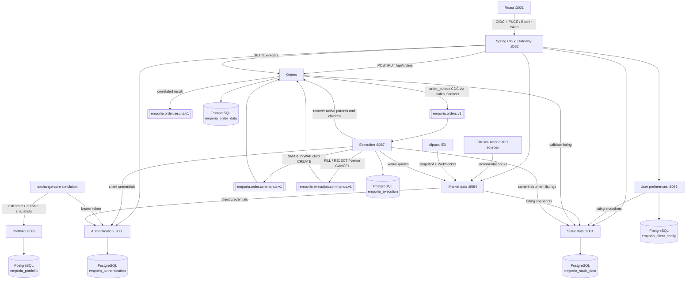

# Emporia Trading Platform

[](https://github.com/nvxtien/emporia/wiki)
[](https://github.com/nvxtien/emporia/wiki/Testing-and-Verification)
[](https://github.com/nvxtien/emporia)
[](https://github.com/nvxtien/emporia)
[](https://github.com/nvxtien/emporia)
[](https://discord.gg/ZbsryA3Tb)

> 📖 **Comprehensive Platform Documentation & Architectural Specifications are published on the [Emporia GitHub Wiki](https://github.com/nvxtien/emporia/wiki)!**

Emporia is an enterprise-grade, distributed stock trading platform built with **Java 21**, **Spring Boot 4.0.7**, **React 19**, **Apache Kafka**, **gRPC**, and **PostgreSQL**. Its deployable boundaries strictly follow business capabilities: static data, user preferences, market data, and order management are independent services, with execution routing isolated behind its own service.

---

## 📚 Documentation & GitHub Wiki

For in-depth architectural guides, domain design patterns, microservice deep dives, and trading business logic formulas, explore the **[Emporia GitHub Wiki](https://github.com/nvxtien/emporia/wiki)**:

| Section | Description |
|---|---|
| 📖 **[Trading Terminology Glossary](https://github.com/nvxtien/emporia/wiki/Trading-Terminology-Glossary)** | Financial terms: Order types (Limit, Market, Stop, TIF), BBO/NBBO, SOR, VWAP, P&L. |
| 📐 **[Architecture & Order Flow](https://github.com/nvxtien/emporia/wiki/Architecture-and-Order-Flow)** | System architecture flow, port matrix, REST vs. Kafka EDA, database ownership. |
| ⚙️ **[Order Management Service](https://github.com/nvxtien/emporia/wiki/Order-Management-Service)** | State machine authority, `OrderCommandHandler`, `ExecutionCommandHandler`, idempotency. |
| 🎯 **[Execution Service](https://github.com/nvxtien/emporia/wiki/Execution-Service)** | Algorithmic routing (`DMA`, `SMART` NBBO selector, `VWAP` slicer), venue gateways. |
| 📜 **[Order Lifecycle & Invariants](https://github.com/nvxtien/emporia/wiki/Business-Logic-Order-Lifecycle)** | State machine invariants, tick/lot size checks, late fill accounting. |
| 🧠 **[Order Routing & Execution](https://github.com/nvxtien/emporia/wiki/Business-Logic-Order-Routing-and-Execution)** | Smart Order Routing (SOR) venue splitting & VWAP time-slicing logic. |
| 📊 **[Market Data & Pricing](https://github.com/nvxtien/emporia/wiki/Business-Logic-Market-Data-and-Pricing)** | L1/L2 order books, Price-Time priority matching, micro-price formulas. |
| 💼 **[Portfolio & Risk Controls](https://github.com/nvxtien/emporia/wiki/Business-Logic-Portfolio-and-Risk-Management)** | Long/short positions, cost basis, Mark-to-Market P&L, fat-finger price collars. |
| 🧩 **[Design Patterns Catalog](https://github.com/nvxtien/emporia/wiki/Design-Patterns)** | CQRS, Event-Driven Architecture, Saga, Strategy, State Machine patterns. |
| 📦 **[Microservices Overview](https://github.com/nvxtien/emporia/wiki/Microservices-Overview)** | Deep-dive into all 8 microservices, Gateway, and OAuth2 Authorization. |
| ⚡ **[Exchange-Core Integration](https://github.com/nvxtien/emporia/wiki/Exchange-Core-Integration)** | Ultra-low latency LMAX Disruptor ring-buffer matching engine integration. |
| 🧪 **[Testing & Verification](https://github.com/nvxtien/emporia/wiki/Testing-and-Verification)** | 91.95% JaCoCo coverage, Testcontainers PostgreSQL specs, Fray concurrency tests. |
| 🛠️ **[Deployment & Operations](https://github.com/nvxtien/emporia/wiki/Deployment-and-Operations)** | Environment prerequisites, Docker Compose, Maven builds, React UI startup. |

---

## Architecture



The browser sees one `/api` surface. The gateway routes requests by path and
HTTP method to the service that owns each business capability. Mutating order
calls (`POST`/`PUT /api/orders/**`) go directly to `order-management`, which
handles them on an in-process LMAX Disruptor and writes `order_outbox` records
in the same persistence boundary as the order transition. Kafka Connect
Debezium CDC-relays those records to `emporia.orders.v1` asynchronously for
execution and audit, so Kafka is not on the browser request critical path. The
same Kafka command path also carries `execution`'s internally generated
SMART/VWAP child orders — see
[Kafka command path](#kafka-command-path-execution-child-orders) below.

## Service ownership

| Directory | Port | Owns |
|---|---:|---|
| `authentication` | 9000 | OAuth2/OIDC login, users, tokens |
| `static-data` | 8081 | Instruments and exchange listings |
| `user-preferences` | 8083 | Per-user watchlists and persisted workspace layouts |
| `market-data` | 8084 HTTP / 50551 gRPC | Simulated, Alpaca IEX, or FIX-simulator market data; venue/composite books; REST, SSE, and gRPC distribution |
| `order-management` | 8086 | Order command hot path (Disruptor), lifecycle, state, history, executions, and idempotency |
| `execution` | 8087 internal | DMA venue access, best-venue SMART routing, scheduled VWAP child orders, and execution reports |
| `portfolio` | 8088 internal | Fully funded cash/equity balances and idempotent exchange snapshot receipts |
| `gateway` | 8082 | Browser security boundary and routing |
| `frontend` | 3001 | React trading workspace |
| `trading-contracts` | not deployed | Versioned Java/Kafka contracts shared at build time |
| `fix-simulator-contracts` | not deployed | Generated FIX-simulator protobuf/gRPC contracts, consumed by `market-data` and `fix-market-simulator` |
| `fix-market-simulator` | 9876 FIX / 50051 gRPC / 8501 REST | Standalone FIX/gRPC market simulator (QuickFIX/J + Guice + Jetty), an optional data source for `market-data`'s `FIX_SIMULATOR_CONNECTIONS` mode |

No running service reads or writes another Emporia service's PostgreSQL database
or schema.
When a service needs listing data, it calls `static-data` and forwards
a bearer token. Orders store an immutable listing snapshot instead of a
cross-schema foreign key.

## Order command flow

### Gateway hot path (browser)

1. Gateway forwards `POST`/`PUT /api/orders/**` to `order-management`.
2. OMS validates the listing snapshot, builds an `OrderCommand`, and submits it
   to the single-writer Disruptor pipeline.
3. `OrderCommandHandler` applies the transition against the in-memory order
   cache, enqueues write-behind persistence, and returns the correlated result
   to the waiting HTTP request.
4. OMS writes order domain events to `order_outbox` with the order transition.
   The Debezium Kafka Connect connector CDC-relays them to `emporia.orders.v1`
   asynchronously for `execution` and audit consumers.

### Kafka command path (execution child orders)

There is no external REST ingress onto this path anymore — `execution` is
the only producer left. SMART venue splits and VWAP time slices it creates
internally reuse the same Kafka command path and `order-management` handler
the gateway hot path uses:

1. `execution` builds a versioned child `OrderCommand` (SMART venue split or
   VWAP time slice) and publishes it to `emporia.order.commands.v1`, keyed by
   the parent order ID so all of one parent's children stay on one partition.
2. `order-management` consumes the command, validates the transition, and
   updates its projection via the same handler path as the gateway hot path.
3. The command result is stored in `processed_order_command`. A redelivered
   Kafka command therefore returns the same result instead of applying the
   change twice.
4. `order-management` publishes the state transition to `emporia.orders.v1`,
   which `execution` consumes to track parent/child fill state.

The six Kafka partitions can process independent orders in parallel while
maintaining the order of commands for one key.

## Execution flow

- DMA sends the order directly to the configured venue gateway. Local development
  uses a deterministic delayed-fill gateway.
- SMART loads every listing for the instrument and walks executable
  opposite-side depth in price/time order. It creates deterministic DMA children
  across venues, observes the parent limit, and waits/retries when liquidity is
  temporarily unavailable.
- VWAP supports absolute start/end seconds and a configurable bucket count. It
  emits increment-aligned catch-up children from the persisted cumulative target,
  parent fills, and active child exposure.
- Child partial and final fills roll up to every parent ancestor atomically with
  weighted-average fill accounting.
- Cancellation is venue-confirmed. A command records a pending
  `targetStatus=CANCELLED`; the venue acknowledgement finalizes it, while a
  racing execution remains valid.
- `EXECUTION_VENUE_MODE=fix` enables the built-in FIXT 1.1 / FIX 5.0 SP2 source
  adapter for new, modify, cancel, and execution-report messages.
- New execution consumers start at the latest order event, so introducing the
  service cannot accidentally execute retained historical orders.
- On restart, execution rebuilds direct-order and SMART/VWAP runtimes from the
  order-management PostgreSQL projection rather than replaying creates.

See the [DMA, SMART, and VWAP execution guide](docs/execution/README.md) for
strategy behavior, order examples, cancellation, recovery, and current
boundaries. Service-level configuration is collected in
[execution/README.md](execution-service/README.md).

Gateway routing, order-route circuit breaker and rate limiter behavior, and the
internal service-account token policy are documented in
[gateway/README.md](gateway/README.md).

## Local prerequisites

- Java 21 or newer
- Maven 3.9+
- Node.js and npm
- PostgreSQL running at `localhost:5432` for non-Docker local runs, with
  logical replication enabled for Debezium outbox CDC
- Docker with Compose for Docker-managed infrastructure or full-stack deployment
- **Exchange-Core Engine**: Clone and install [`exchange-core`](https://github.com/nvxtien/exchange-core) (`mvn clean install`) into your local Maven repository before building Emporia.

Non-Docker local PostgreSQL settings:

- Database: `emporia`
- Username: your OS username by default (the role Homebrew's `postgresql`
  formula creates), not `postgres` — `scripts/run-local.sh` and
  `scripts/seed-portfolio-client.sh` default `DB_USERNAME` accordingly;
  override `DB_USERNAME` if your local Postgres uses a different role
- Password: `admin123`
- Logical replication: `wal_level=logical`, `max_replication_slots >= 1`, and
  `max_wal_senders >= 1`; restart PostgreSQL after changing these settings

Flyway creates these service-owned schemas in the local `emporia` database:
`emporia_authentication`, `emporia_static_data`, `emporia_client_config`,
`emporia_order_data`, `emporia_execution`, and `emporia_portfolio`.

## Run modes

| Mode | Spring services run in | PostgreSQL runs in | PostgreSQL layout |
|---|---|---|---|
| Local | Host JVM | Local PostgreSQL on `localhost:5432` | One `emporia` database with service-owned schemas |
| Infrastructure-only Docker | Host JVM | Docker containers exposed on `5433`-`5438` | One PostgreSQL database/container per service that owns persistent data |
| Full Docker | Docker containers | Docker containers | One PostgreSQL database/container per service that owns persistent data |

See [Start locally](#start-locally) below for how each mode is brought up.
Every supported mode starts Kafka Connect on container port `8083` and exposes
it on host port `18083` where needed, leaving host port `8083` available for
`user-preferences-service`.

## Start locally

`scripts/run-local.sh` (Mode 1) and `scripts/run-infra-docker.sh` (Mode 2)
build the reactor, start every service in the background, wait for each
`/actuator/health` to report up, and print the frontend URL. **This is the
supported way to bring up the stack — don't start services one-by-one by
hand.** Full Docker mode already has `scripts/local-deploy.sh` and the
compose commands in the Docker Deployment section below.

Run all commands from the repository root.

1. Clone and install the `exchange-core` dependency into your local Maven repository:

   ```bash
   git clone https://github.com/nvxtien/exchange-core.git
   cd exchange-core
   mvn clean install
   cd ..
   ```

2. Start the stack. For Mode 1 (Local), first confirm the shared
   non-Docker PostgreSQL database is running on `localhost:5432` (see
   [Local prerequisites](#local-prerequisites) above):

   ```bash
   scripts/run-local.sh
   ```

   For Mode 2 (Infrastructure-only Docker), no local PostgreSQL is needed —
   the script starts the per-service containers itself:

   ```bash
   scripts/run-infra-docker.sh
   ```

3. Open `http://localhost:3001` and sign in with `admin` / `admin123` once
   the script prints "stack is up".

Both scripts default `execution` to `EXECUTION_VENUE_MODE=exchange-core`
with `EXCHANGE_CORE_ACCOUNTING_MODE=full-equity-risk`, and automatically seed
a USD portfolio balance for the bootstrap admin so it can receive an
exchange-core risk seed. `market-data` defaults to
`MARKET_DATA_PROVIDER=simulated`; export `MARKET_DATA_PROVIDER=alpaca-iex`
plus `APCA_API_KEY_ID`/`APCA_API_SECRET_KEY` before running either script to
use live Alpaca IEX data instead:

```bash
MARKET_DATA_PROVIDER=alpaca-iex \
APCA_API_KEY_ID='your-alpaca-key-id' \
APCA_API_SECRET_KEY='your-alpaca-secret-key' \
scripts/run-local.sh
```

> **🔑 Registering Alpaca API Credentials**:
> 1. Sign up for a free account at [alpaca.markets](https://alpaca.markets).
> 2. Open the **Paper Trading** dashboard (free sandbox).
> 3. Click **Generate New API Key** in the right-hand panel.
> 4. Copy your **API Key ID** (`APCA_API_KEY_ID`) and **Secret Key** (`APCA_API_SECRET_KEY`).

To instead consume incremental order books from one or more FIX simulator
gRPC sources, export `MARKET_DATA_PROVIDER=fix-simulator` and
`FIX_SIMULATOR_CONNECTIONS`; see the
[market-data runbook](market-data-service/README.md) for the
connection string format and behavior.

Each script logs every service to `.local-run/logs/<service>.log` and tracks
its pid in `.local-run/pids/<service>.pid`. Both scripts start Kafka Connect
and register the `order-outbox-connector` after `order-management` is healthy
but before `execution`, `gateway`, and the frontend start accepting traffic.

#### Check service status

Health check every service (all default to `GET /actuator/health` without a
token):

```bash
for pair in "authentication:9000" "static-data:8081" "user-preferences:8083" \
            "market-data:8084" "order-management:8086" \
            "execution:8087" "portfolio:8088" "gateway:8082"; do
  name="${pair%%:*}"; port="${pair##*:}"
  echo "$name: $(curl -fsS http://localhost:$port/actuator/health)"
done
curl -fsS -o /dev/null -w 'frontend: %{http_code}\n' http://localhost:3001
```

Other useful checks:

```bash
cat .local-run/pids/*.pid                                      # pid recorded per running service
tail -f .local-run/logs/execution-service.log                    # live logs for one service
docker compose ps kafka kafka-connect                            # Kafka/Connect container health
curl -fsS http://localhost:18083/connectors/order-outbox-connector/status
```

Stop everything either script started, including the Kafka and/or
per-service PostgreSQL containers:

```bash
scripts/stop-services.sh
```

If you create additional trading users after the stack is up (e.g. through
the admin user-management UI), seed their exchange-core portfolio balance the
same way the bootstrap admin is seeded:

```bash
scripts/seed-portfolio-client.sh <username>
```

### Manual, per-service startup

Running one service by hand (for example under a debugger) is still
supported. Kafka and Kafka Connect must already be running
(`docker compose up -d kafka kafka-connect`), and `authentication` should start
before any service that validates its own OAuth tokens. After
`order-management` is healthy, run `scripts/register-outbox-connector.sh`
before starting `execution` or `gateway`; that connector is what relays
`order_outbox` to `emporia.orders.v1`. Each service's own README documents its
environment variables and `mvn spring-boot:run` / `npm run dev` command:
[`authentication`](authentication/README.md),
[`static-data`](static-data-service/README.md),
[`user-preferences`](user-preferences-service/README.md),
[`market-data`](market-data-service/README.md),
[`order-management`](order-management-service/README.md),
[`execution`](execution-service/README.md),
[`portfolio`](portfolio-service/README.md),
[`gateway`](gateway/README.md), and [`frontend`](frontend/README.md).

Every service supports `GET /actuator/health` without a token. Kafka and Kafka
Connect are healthy when `docker compose ps kafka kafka-connect` reports
`healthy`.

---

## Verify

The full verification runbook lives in the
[Testing & Verification wiki](https://github.com/nvxtien/emporia/wiki/Testing-and-Verification).
It covers Maven `verify`, PMD reports, frontend checks, property tests,
PostgreSQL integration tests, Fray concurrency checks, TLA+ model checking, and
the OIDC/Kafka smoke test.

Run `scripts/install-git-hooks.sh` once per clone to enable local CI: a
pre-push hook that runs the same `mvn verify` + frontend checks before code
leaves your machine. See [docs/CI_CD.md](docs/CI_CD.md) for what it checks
and the on-demand local deploy script.

---

## 🐳 Docker Deployment

In addition to running services locally on your host machine, Emporia supports
containerized deployment with Docker and Docker Compose. As with
[Start locally](#start-locally) above, use the provided scripts rather than
starting containers or services by hand.

### 1. Infrastructure-Only Docker Setup

This is Mode 2 from [Start locally](#start-locally): `scripts/run-infra-docker.sh`
starts one PostgreSQL 16 container per service that owns persistent data
(ports `5433`-`5438`) plus Apache Kafka 4.3.1 (`9092`) and Kafka Connect
(`18083` on the host), then runs every Spring Boot service and the frontend on
your host JVM against those containers.

| Service | Host port | Database | Schema |
|---|---:|---|---|
| `authentication` | `5433` | `emporia_authentication` | `emporia_authentication` |
| `static-data` | `5434` | `emporia_static_data` | `emporia_static_data` |
| `user-preferences` | `5435` | `emporia_user_preferences` | `emporia_client_config` |
| `order-management` | `5436` | `emporia_order_management` | `emporia_order_data` |
| `execution` | `5437` | `emporia_execution` | `emporia_execution` |
| `portfolio` | `5438` | `emporia_portfolio` | `emporia_portfolio` |

```bash
scripts/run-infra-docker.sh
```

To bring up just the containers, for example to run one service manually
against them (see [Manual, per-service startup](#manual-per-service-startup)):

```bash
docker compose up -d
docker compose ps
```

### 2. Full-Stack Docker Container Deployment

To launch all 8 microservices, API Gateway, React UI, service-owned PostgreSQL
instances, Kafka, Kafka Connect, and the outbox connector registrar in
containers, build the Maven jars first — each Dockerfile copies a pre-built
`target/*.jar` rather than building from source — then run
`scripts/local-deploy.sh`:

```bash
# 1. Build and install exchange-core into your local Maven repo
git clone https://github.com/nvxtien/exchange-core.git && cd exchange-core && mvn clean install && cd ..

# 2. Build local Maven JAR artifacts
mvn clean install -DskipTests

# 3. Build images and start the full-stack containers (default: simulated market data)
scripts/local-deploy.sh

# Or with live Alpaca IEX market data:
MARKET_DATA_PROVIDER=alpaca-iex \
APCA_API_KEY_ID='your-alpaca-key-id' \
APCA_API_SECRET_KEY='your-alpaca-secret-key' \
scripts/local-deploy.sh
```

### 3. Stop Docker

One command stops everything regardless of which mode you used — host-JVM
processes from `run-local.sh`/`run-infra-docker.sh`, the infra containers
from `docker-compose.yml`, and the full-stack containers from
`docker-compose.full.yml`:

```bash
scripts/stop-services.sh
```

Do not add `-v` to the `docker compose` commands inside it unless you
intentionally want to delete the local per-service database volumes and the
Kafka volume.
