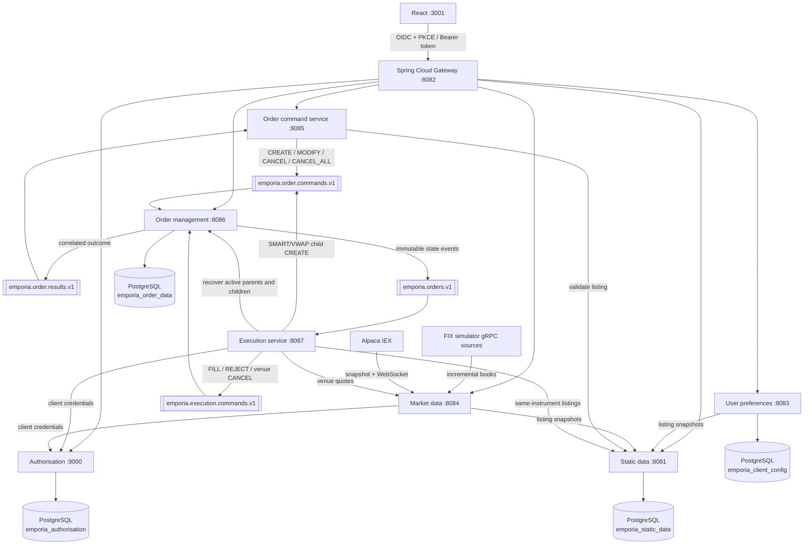

# Emporia Trading Platform

Emporia is a Spring Boot and React trading platform. Its deployable boundaries
follow business capabilities: static data, user preferences, market data, order
command handling, and order management are independent services, with execution
routing isolated behind its own service.

## Architecture



The browser sees one `/api` surface. The gateway routes requests by path and
HTTP method to the service that owns each business capability.

## Service ownership

| Directory | Port | Owns |
|---|---:|---|
| `authorisation-service` | 9000 | OAuth2/OIDC login, users, tokens |
| `static-data-service` | 8081 | Instruments and exchange listings |
| `user-preferences-service` | 8083 | Per-user watchlists and persisted workspace layouts |
| `market-data-service` | 8084 HTTP / 50551 gRPC | Simulated, Alpaca IEX, or FIX-simulator market data; venue/composite books; REST, SSE, and gRPC distribution |
| `order-command-service` | 8085 | Authenticated create, modify, cancel, and cancel-all command boundary |
| `order-management-service` | 8086 | Order lifecycle, state, history, executions, and command idempotency |
| `execution-service` | 8087 internal | DMA venue access, best-venue SMART routing, scheduled VWAP child orders, and execution reports |
| `gateway` | 8082 | Browser security boundary and routing |
| `frontend` | 3001 | React trading workspace |
| `trading-contracts` | not deployed | Versioned Java/Kafka contracts shared at build time |

No running service reads or writes another Emporia service's PostgreSQL schema.
When a service needs listing data, it calls `static-data-service` and forwards
a bearer token. Orders store an immutable listing snapshot instead of a
cross-schema foreign key.

## Kafka order flow

1. `order-command-service` creates a versioned command with a unique
   `commandId` and publishes it to `emporia.order.commands.v1`.
2. `order-management-service` consumes the command, validates the transition, and
   updates its PostgreSQL projection in a transaction.
3. The command result is stored in `processed_order_command`. A redelivered Kafka
   command therefore returns the same result instead of applying the change twice.
4. `order-management-service` publishes the state transition to `emporia.orders.v1`
   and a correlated response to `emporia.order.results.v1`.
5. `order-command-service` completes the waiting browser request. If Kafka or
   the order processor does not answer within eight seconds, it returns a
   timeout or service error rather than pretending the order succeeded.

Commands are keyed by order ID (or user subject for cancel-all). The six Kafka
partitions can process independent orders in parallel while maintaining the order
of commands for one key.

## Execution flow

- DMA sends the order directly to the configured venue gateway. Local development
  uses a deterministic delayed-fill gateway.
- SMART loads every listing for the instrument and walks executable
  opposite-side depth in price/time order. It creates deterministic DMA children
  across venues, observes the parent limit, and waits/retries when liquidity is
  temporarily unavailable.
- VWAP supports absolute start/end seconds and a configurable bucket count. It
  emits increment-aligned catch-up children from the persisted cumulative target,
  parent fills, and active child exposure.
- Child partial and final fills roll up to every parent ancestor atomically with
  weighted-average fill accounting.
- Cancellation is venue-confirmed. A command records a pending
  `targetStatus=CANCELLED`; the venue acknowledgement finalizes it, while a
  racing execution remains valid.
- `EXECUTION_VENUE_MODE=fix` enables the built-in FIXT 1.1 / FIX 5.0 SP2 source
  adapter for new, modify, cancel, and execution-report messages.
- New execution consumers start at the latest order event, so introducing the
  service cannot accidentally execute retained historical orders.
- On restart, execution rebuilds direct-order and SMART/VWAP runtimes from the
  order-management PostgreSQL projection rather than replaying creates.

See [execution-service/README.md](execution-service/README.md) for configuration
and protocol details.

## Local prerequisites

- Java 21 or newer
- Maven 3.9+
- Node.js and npm
- Docker with Compose
- PostgreSQL running at `localhost:5432`

Local PostgreSQL settings:

- Database: `english`
- Username: `tiennv`
- Password: `admin123`

Flyway creates these schemas: `emporia_authorisation`, `emporia_static_data`,
`emporia_client_config`, and `emporia_order_data`.

## Start locally

Run all commands from the repository root. Keep each long-running Maven or npm
command in its own terminal.

1. Start Kafka:

   ```bash
   docker compose -f emporia/compose.kafka.yml up -d
   docker compose -f emporia/compose.kafka.yml ps
   ```

2. Build and install the shared Kafka contract and all split services:

   ```bash
   mvn -f emporia/pom.xml install
   ```

3. Start the authorisation service:

   ```bash
   cd emporia/authorisation-service
   SERVER_PORT=9000 \
   AUTH_ISSUER=http://localhost:3001 \
   OAUTH_REDIRECT_URI=http://localhost:3001/auth/callback \
   OAUTH_POST_LOGOUT_REDIRECT_URI=http://localhost:3001/auth/logout-callback \
   BOOTSTRAP_ADMIN_ENABLED=true \
   BOOTSTRAP_ADMIN_USERNAME=admin \
   BOOTSTRAP_ADMIN_EMAIL=admin@localhost \
   BOOTSTRAP_ADMIN_PASSWORD=admin123 \
   BOOTSTRAP_ADMIN_DESK=default \
   BOOTSTRAP_ADMIN_CAN_TRADE=true \
   DB_PASSWORD=admin123 \
   mvn spring-boot:run
   ```

4. Start the six trading microservices, one command per terminal:

   ```bash
   cd emporia/static-data-service && mvn spring-boot:run
   ```

   To build current active US-equity primary and `XOSR` composite listings from
   Alpaca's asset master:

   ```bash
   cd emporia/static-data-service
   ALPACA_REFERENCE_DATA_IMPORT_ENABLED=true \
   APCA_API_KEY_ID=your-alpaca-key-id \
   APCA_API_SECRET_KEY=your-alpaca-secret-key \
   mvn spring-boot:run
   ```

   This importer reads `APCA_API_ENDPOINT` (default
   `https://paper-api.alpaca.markets/v2`) and does not persist either
   credential. See [static-data-service/README.md](static-data-service/README.md).

   ```bash
   cd emporia/user-preferences-service && mvn spring-boot:run
   ```

   ```bash
   cd emporia/market-data-service && mvn spring-boot:run
   ```

   The market-data service uses its deterministic simulator by default. It also
   exposes a browser SSE stream on port `8084` and the
   `marketdataservice.MarketDataService` gRPC interface on port `50551`.

   To use Alpaca's free real-time IEX WebSocket feed:

   ```bash
   cd emporia/market-data-service
   MARKET_DATA_PROVIDER=alpaca-iex \
   APCA_API_KEY_ID=your-alpaca-key-id \
   APCA_API_SECRET_KEY=your-alpaca-secret-key \
   mvn spring-boot:run
   ```

   ### Alpaca credential handling

   `APCA_API_KEY_ID` and `APCA_API_SECRET_KEY` are read from the market-data
   service's process environment. Emporia does not persist them in PostgreSQL,
   Docker, `application.yml`, or another repository file. They remain available
   only to the running process and disappear when that process stops.

   Never commit real Alpaca credentials or place them directly in
   `application.yml`. For shared or production environments, inject these
   variables from the deployment platform's secret manager. Avoid entering the
   secret directly in a shell command because it may be retained in shell
   history. Anyone with sufficient access to inspect the running process may
   also be able to inspect its environment.

   If a credential is exposed, revoke or rotate it in Alpaca, stop the
   market-data service, and start it again with the replacement values. The
   service must be restarted after a rotation because it reads the credentials
   during startup.

   Alpaca mode subscribes to trades and top-of-book quotes as symbols are
   requested. It seeds an empty cache from Alpaca's latest IEX snapshot REST
   endpoint, so prices remain available before the WebSocket emits its first
   event. The free IEX feed supplies one real bid and offer level rather than
   the simulator's five levels. Reported volume is the IEX trade volume observed
   since the service subscribed, not consolidated daily volume. It supports up
   to 30 active symbols by default, automatically reconnects, and returns HTTP
   503 only if neither the snapshot endpoint nor the WebSocket supplies an
   initial quote within five seconds. Override these defaults with
   `ALPACA_MAX_SYMBOLS`, `ALPACA_INITIAL_DATA_TIMEOUT`,
   `ALPACA_RECONNECT_DELAY`, `ALPACA_WEBSOCKET_URL`, and
   `ALPACA_SNAPSHOTS_URL`.

   See [Alpaca IEX market-data flow](docs/market-data/README.md) for example
   source payloads, backend transformations, frontend field mappings, and
   operational limitations.

   To consume incremental order books directly from one or more FIX simulator
   gRPC sources:

   ```bash
   cd emporia/market-data-service
   MARKET_DATA_PROVIDER=fix-simulator \
   FIX_SIMULATOR_CONNECTIONS='XNAS=localhost:50051,XNYS=localhost:50052' \
   mvn spring-boot:run
   ```

   Multiple replicas for one venue are separated with `|`, for example
   `XNAS=nasdaq-a:50051|nasdaq-b:50051`. Listings are assigned
   deterministically across those replicas. The provider reconnects,
   resubscribes, maintains entries by FIX entry ID, and applies
   `NEW`, `CHANGE`, `OVERLAY`, and `DELETE` updates.

   Browser clients use `GET /api/market-data/stream` and receive conflated
   continuous quotes. Snapshot REST endpoints remain available for compatibility.
   Composite listings use exchange MIC `XOSR`; the service combines all
   same-symbol venue books while retaining each level's source listing and MIC.

   See the [market-data service runbook](market-data-service/README.md) for
   configuration, observability, and deployment details.

   ```bash
   cd emporia/order-command-service && mvn spring-boot:run
   ```

   `order-command-service` owns create, modify, single-cancel, and cancel-all
   HTTP commands. There is no separate `order-monitor` process or port.

   ```bash
   cd emporia/order-management-service && mvn spring-boot:run
   ```

   ```bash
   cd emporia/execution-service && mvn spring-boot:run
   ```

   The execution service uses delayed simulated venue fills by default. Its
   OAuth client is registered automatically by the local authorisation
   configuration. Use the same `EXECUTION_OAUTH_CLIENT_SECRET` value in both
   services when overriding the local default.

5. Start the gateway on the browser's proxy port:

   ```bash
   cd emporia/gateway
   SERVER_PORT=8082 \
   EMPORIA_AUTH_ISSUER=http://localhost:3001 \
   mvn spring-boot:run
   ```

6. Start React:

   ```bash
   cd emporia/frontend
   npm install
   VITE_GATEWAY_PROXY_TARGET=http://localhost:8082 npm run dev -- --port 3001
   ```

7. Open `http://localhost:3001` and sign in with `admin` / `admin123`.

Every service supports `GET /actuator/health` without a token. Kafka is healthy
when `docker compose -f emporia/compose.kafka.yml ps` reports `healthy`.

## Verify

Compile, test, and run PMD for every service, then verify the frontend:

```bash
mvn -f emporia/pom.xml verify
mvn -f emporia/authorisation-service/pom.xml verify
mvn -f emporia/gateway/pom.xml verify
npm --prefix emporia/frontend run lint
npm --prefix emporia/frontend run build
npm --prefix emporia/frontend run test:e2e
```

The Maven `verify` phase runs PMD 7.26.0 through Maven PMD Plugin 3.28.0 and
fails on violations or PMD processing errors. The shared
[`static-analysis/ruleset.xml`](static-analysis/ruleset.xml) concentrates on correctness,
resource ownership, exception integrity, concurrency, and unambiguous
performance problems; it intentionally excludes formatting and subjective
style checks. Generated sources and test sources are excluded.

To generate browsable PMD reports without running the full build:

```bash
mvn -f emporia/pom.xml -DskipTests pmd:pmd
mvn -f emporia/authorisation-service/pom.xml -DskipTests pmd:pmd
mvn -f emporia/gateway/pom.xml -DskipTests pmd:pmd
```

Each module writes XML to `target/pmd.xml` and HTML to
`target/reports/pmd.html`.

Run only the jqwik order invariants:

```bash
mvn -f emporia/pom.xml -pl order-management-service -am \
  -Dtest=TradingOrderPropertyTest \
  -Dsurefire.failIfNoSpecifiedTests=false test
```

The generated properties cover positive and increment-aligned quantities,
positive tick-aligned limit prices, partial-fill quantity accounting,
modifications bounded by traded quantity, two-fill weighted averages,
randomized command and venue-event sequences, pending cancellation,
cancel-versus-fill races in both arrival orders, late fills after venue
acknowledgement, and idempotent command redelivery.

Run the real PostgreSQL optimistic-lock race with Testcontainers:

```bash
mvn -f emporia/pom.xml -Ppostgres-it -pl order-management-service -am test
```

This opt-in test applies Flyway migrations to PostgreSQL 16 and races two
independent transactions that loaded the same entity version. See the
[order-management service documentation](order-management-service/README.md#postgresql-concurrency-test)
for the OrbStack command and assertions.

Run the controlled cancel-versus-full-fill concurrency pilot with Fray:

```bash
mvn -f emporia/pom.xml -Pfray -pl order-management-service -am test
```

The profile adds the isolated Fray source set, runs only its pilot test, and
leaves ordinary `mvn test` unchanged. See the
[order-management service documentation](order-management-service/README.md#controlled-concurrency-pilot)
for its scope and limitations.

Model-check the proposed fill/cancel state machine with TLC:

```bash
cd emporia/verification/order-lifecycle
java -XX:+UseParallelGC -jar /path/to/tla2tools.jar \
  -config OrderLifecycle.cfg \
  -metadir target/tlc \
  OrderLifecycle.tla
```

See the [order lifecycle TLA+ model](verification/order-lifecycle/README.md) for the
checked invariants, race semantics, and model boundaries.

Java aggregate validation and Flyway migrations `V2` and `V4` enforce the
corresponding persisted-state and pending-cancellation invariants. See the
[order-management invariant documentation](order-management-service/README.md) for the
constraint matrix, migration behavior, and focused test commands.

With the application running, execute the full OIDC and Kafka smoke test:

```bash
EMPORIA_ORIGIN=http://localhost:3001 \
EMPORIA_USERNAME=admin \
EMPORIA_PASSWORD=admin123 \
node emporia/scripts/oidc-smoke-test.mjs
```

The check signs in with Authorization Code + PKCE, verifies instruments,
watchlist, quotes, and the order blotter, then exercises a DMA cancel/fill race,
depth-aware SMART, scheduled VWAP, materialized history, and
order-command-service cancel-all through the live Kafka flow.

## Stop locally

Stop each foreground Spring Boot/npm process with `Ctrl+C`, then stop Kafka:

```bash
docker compose -f emporia/compose.kafka.yml down
```

Do not add `-v` unless you intentionally want to delete the local Kafka volume.
