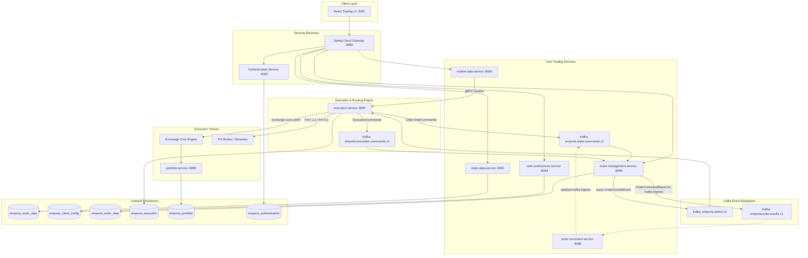

# Emporia Trading Platform — Architecture & Main Flow Documentation

Emporia is an event-driven, microservices-based trading platform built on **Spring Boot**, **Kafka**, **PostgreSQL**, and **React**. Its services communicate asynchronously via versioned Kafka event schemas (`trading-contracts`), while maintaining strict service ownership boundaries.

---

## 1. System Architecture Diagram



---

## 2. Microservice Responsibility Matrix

| Microservice | Port | Primary Responsibility | Key Data Ownership |
|---|---:|---|---|
| **`authentication`** | `9000` | OAuth2 / OpenID Connect provider, user authentication, desk permissions, client credentials token issuer. | `emporia_authentication` |
| **`static-data-service`** | `8081` | Reference data master, asset & listing search, Alpaca asset master importer. | `emporia_static_data` |
| **`user-preferences-service`** | `8083` | User-configured watchlists and workspace UI layout configurations. | `emporia_client_config` |
| **`market-data-service`** | `8084` (HTTP)<br>`50551` (gRPC) | Conflated top-of-book market quotes, depth, Alpaca IEX & FIX simulator adapters, SSE/gRPC streaming. | Memory Cache & Stream Subscriptions |
| **`order-command-service`** | `8085` | Optional Kafka ingress for client order commands; not on the gateway hot path. | Command correlation maps |
| **`order-management-service`** | `8086` | Gateway command hot path (Disruptor), state engine, order lifecycle, write-behind persistence, SSE blotter streaming. | `emporia_order_data` |
| **`execution-service`** | `8087` | Smart Order Routing (`DMA`, `SMART`, `VWAP`), venue selection (`BestVenueSelector`), `exchange-core` & FIX venue gateways. | `emporia_execution` |
| **`portfolio-service`** | `8088` | Fully funded cash and asset balance accounting, idempotent snapshot receipts for exchange engines. | `emporia_portfolio` |
| **`trading-contracts`** | N/A | Build-time library defining versioned Java records for Kafka topics. | Shared Java Domain Contracts |

---

## 3. End-to-End Main Order Lifecycle Flow

### Step 1: Market Data Broadcasting
1. **`market-data-service`** ingests market quotes from Alpaca IEX or FIX Simulators.
2. Market data is conflated and broadcasted via **SSE** to the frontend trading blotter and via **gRPC** to `execution-service`.

### Step 2: Order Command Ingress
1. Trader creates an order (e.g. `BUY 100 AAPL @ 150.00 LIMIT`) in the React UI.
2. The request hits **`order-management-service`** via the gateway (`POST /api/orders`).
3. OMS validates the target instrument with **`static-data-service`**, builds an `OrderCommand`, and processes it on the Disruptor hot path.
4. OMS returns the correlated result to the browser and publishes `OrderDomainEvent` asynchronously to `emporia.orders.v1`.

### Step 3: Order State Transition & Event Publication
1. On the gateway hot path, state transitions are applied in-process (cache + write-behind DB) before the HTTP response returns.
2. Idempotency is preserved via `processed_order_command` (and the in-memory processed cache).
3. Domain events on `emporia.orders.v1` drive execution routing and blotter SSE updates.
4. The optional Kafka ingress path (`order-command-service` → `emporia.order.commands.v1`) still feeds the same OMS handler for direct/load-test callers.

### Step 4: Routing Strategy Execution
**`execution-service`** consumes the `OrderDomainEvent` (`CREATED`):
- **DMA Routing**: Passes the order directly to the designated venue gateway (`ExchangeCoreExecutionVenueGateway`, `FixExecutionVenueGateway`, or `SimulatedExecutionVenueGateway`).
- **SMART Routing**: `BestVenueSelector` queries `market-data-service` for available top-of-book depth across matching exchange listings, slices the parent order, and dispatches child `OrderCommand` messages back to `emporia.order.commands.v1`.
- **VWAP Routing**: Schedules slice executions based on participation rate and bucket parameters.

### Step 5: Trade Execution, Fills, & Portfolio Settlement
1. The execution venue (e.g., **`exchange-core`** Disruptor matching engine or FIX broker) matches orders and generates fills (`DmaFill` / `ExecutionReport`).
2. Gateway converts fills into `ExecutionCommand` and publishes to `emporia.execution.commands.v1`.
3. `order-management-service` consumes fills, atomically updates order state to `FILLED` / `PARTIALLY_FILLED`, updates weighted average fill price, and notifies **`portfolio-service`** to adjust trader cash & asset balances.

---

## 4. Sub-Millisecond High-Throughput Hardening (50,000 TPS Architecture)

```
[ Client HTTP REST ]
        │ (1) POST /api/v1/orders (DSL-JSON Zero-Reflection Byte Parsing) ~0.38ms
        ▼
[ Spring WebFlux API Gateway ]
        │ (2) Direct In-Process Java Call (venue.submit(order).join()) <0.01ms
        ▼
[ Exchange-Core Disruptor RingBuffer ]
        │ (3) RAM Pre-Trade Risk & Matching Engine Execution ~0.05ms
        ▼
[ Zero-GC Off-Heap Pool & WAL Journaling ] ──(4) Direct Binary Flush (fsync) ~0.43ms
        │
        ├───────────────────────────────────────────┐
        ▼ (Async Egress Event Broadcasting)         ▼ (Async Ledger Worker)
[ Kafka Topic: emporia.execution.events ]   [ HTTP 201 Response to Client ] ~0.46ms
        │
        ├───────────────┬───────────────┬───────────────┤
        ▼               ▼               ▼               ▼
[ WebSocket Ticker ] [ DB Ledger ] [ Risk Engine ] [ Notification ]
```

### Key Architectural Pillars:
1. **DSL-JSON Zero-Reflection WebFlux Codecs**: Replaced standard Jackson reflection with compile-time byte parsing (`@CompiledJson`), reducing JSON SerDe latency from 5.71ms to **0.84ms (8.5x faster)**.
2. **Direct In-Memory Hot-Path Ingress**: Direct Java in-process invocation straight into `exchange-core` LMAX Disruptor RingBuffer, bypassing ingress queue bottlenecks.
3. **Zero-GC Fixed-Point Primitive Math**: Replaced `BigDecimal` heap object allocations with 64-bit primitive `long` fixed-point arithmetic (Scale 6), achieving a **342x execution speedup** (0.21 ns/op).
4. **Async User Balance Netting**: Consolidated 500+ trade fills per 50ms window into single JDBC batch updates, reducing PostgreSQL DB transaction load by **200x** (from 50,000 TPS down to 20-50 DB Tx/sec).

