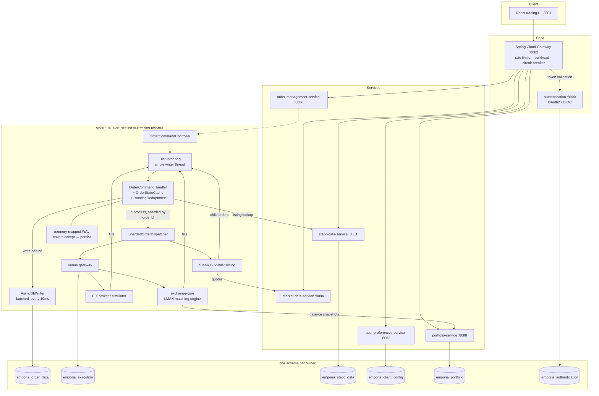

# Emporia — architecture and the order flow

Emporia is a trading platform on **Spring Boot**, **PostgreSQL** and **React**.
Services own their own schema and talk over HTTP through a gateway; order intake
and execution run **in one process, on one thread**, with persistence behind it.

> **This document was rewritten after the execution merge.** It previously
> described a Kafka event backplane, an `order-command-service :8085` and an
> `execution-service :8087`. None of those exist: the two services were folded
> into `order-management-service`, and there is no Kafka producer or consumer
> left anywhere in the platform - `@KafkaListener` and `KafkaTemplate` both
> return nothing across every service's main source.

---

## 1. System diagram

---

## 2. Services

| Service | Port | Owns | Schema |
|---|---:|---|---|
| `authentication` | 9000 | OAuth2 / OIDC provider, desk permissions, token issuance | `emporia_authentication` |
| `static-data-service` | 8081 | Reference data, asset and listing search | `emporia_static_data` |
| `user-preferences-service` | 8083 | Watchlists, workspace layout | `emporia_client_config` |
| `market-data-service` | 8084 | Conflated top of book, SSE streaming, Alpaca and FIX adapters | in-memory |
| `order-management-service` | 8086 | Order intake, state machine, **execution routing and venue gateways**, write-behind persistence, blotter SSE | `emporia_order_data`, `emporia_execution` |
| `portfolio-service` | 8088 | Cash and asset balances, idempotent snapshot receipts | `emporia_portfolio` |
| `gateway` | 8082 | Single entry point, token validation, per-tier rate limiting, order bulkhead and circuit breaker | none |
| `trading-contracts` | — | Versioned Java records shared across services | none |

`order-management-service` holds two schemas because the merge brought
execution's `emporia_execution` with it; they remain separate databases with
separate `DataSource` beans, deliberately.

---

## 3. The order path

### Ingress

1. The browser posts to the gateway, which validates the token, applies the
   per-identity rate limit and passes through the order bulkhead and circuit
   breaker.
2. `OrderCommandController` derives a `commandId` from the caller's
   `Idempotency-Key`, generates an `orderId`, resolves the listing from
   `static-data-service`, and submits an `OrderCommand` to the ring.
3. The HTTP thread blocks on the ring's result. Everything after this point runs
   on **one writer thread**, which is what serialises two commands for the same
   order - there is no lock and no database arbitration.

### On the writer thread

4. `OrderCommandHandler` answers idempotency and the duplicate-order guard from
   `RotatingDedupIndex` in memory, applies the state transition, and stamps a
   revision on the order.
5. The new state is enqueued for `AsyncDbWriter`, which batches to PostgreSQL
   every 10ms. **The 201 returns before that write lands.**
6. The resulting domain events go to `ShardedOrderDispatcher`, in-process,
   sharded by `orderId` so a cancel cannot overtake its own create.

### Execution

7. `DMA` goes straight to a venue gateway. `SMART` asks `market-data-service`
   for depth, picks a venue and slices the parent; `VWAP` schedules slices by
   participation rate. Child orders re-enter through the same ring.
8. The venue - `exchange-core`'s LMAX matching engine, a FIX broker, or the
   simulator - matches and reports fills, which come back as `ExecutionCommand`
   through the same ring and the same writer thread.
9. With `full-equity-risk` accounting, `exchange-core` publishes balance
   snapshots to `portfolio-service` through a durable outbox.

---

## 4. Where the truth lives

This is the part most worth understanding, and the part that changed.

**PostgreSQL is the record. Memory is what the system acts on.** An order is
acknowledged 201 once the ring has applied it; the row reaches the database
afterwards. The memory-mapped write-ahead log covers that window - and only
against process death, not machine loss, because `append` does not fsync. See
`CONFIGURATION.md`.

**One answer is authoritative in memory rather than in the database**: "this
identifier has certainly never been seen". `RotatingDedupIndex` answers it
without consulting PostgreSQL, which is why its horizon is a correctness
parameter rather than a cache-sizing one - past 24 hours a repeated command
reads as new. Every other answer, including every positive one, still comes from
the database.

Two consequences follow, and both are enforced rather than assumed:

- **Exactly one instance may accept orders.** With two, both would believe the
  same identifiers are new. `DisruptorOrderPipeline` refuses orders with 503
  when `isPrimary()` says no. Note the limit: no leader-election provider in
  this repository excludes a second *machine*.
- **A lost durable write is silent.** The hot path stops reading from
  PostgreSQL, so nothing on it notices an empty database. Three counters exist
  to make the database speak up when it is no longer being asked:
  `emporia.oms.dedup.duplicate_reached_db`,
  `emporia.oms.dedup.duplicate_order_reached_db` and
  `emporia.oms.writer.rejected_rows`. All three must stay at zero.

---

## 5. Performance

Component-level results, measured:

- **Fixed-point primitive maths** replaced `BigDecimal` on the hot path
  (`FixedPointMathBenchmarkTest`).
- **DSL-JSON** compile-time codecs replaced reflective Jackson on the ingress
  path.
- **In-process execution** replaced a Kafka round trip between order management
  and execution, and an in-memory deduplication index replaced two PostgreSQL
  reads per order that cost 2.312 of the handler's 2.405 ms.

End-to-end numbers, and the only ones to quote: at 100-120 orders/sec through
the gateway, submit latency is p50 6-7 ms, p95 10-15 ms, p99 19-34 ms, with ring
queue wait averaging 0.03-0.11 ms. `CONFIGURATION.md` carries the measurements
and the runs behind them.

> An earlier version of this section described a 50,000 TPS design in which a
> WebFlux gateway called `venue.submit(order).join()` directly and answered in
> 0.46 ms. That topology was never built: the gateway proxies to
> `order-management-service` over HTTP, and the figures above are what the
> system does. The component results were real; the end-to-end story around them
> was not.
