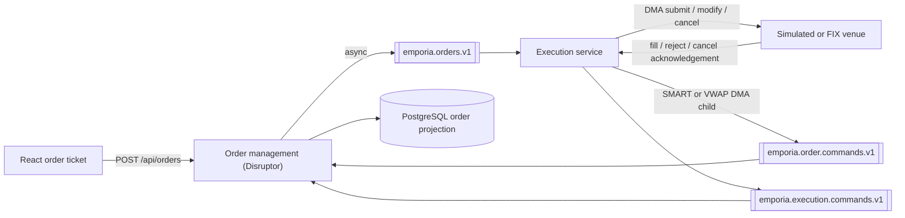

# DMA, SMART, and VWAP execution

Emporia supports three execution destinations:

| Destination | Behavior | Resulting orders |
|---|---|---|
| `DMA` | Sends the order directly to the venue identified by its listing | The submitted order is the venue order |
| `SMART` | Walks executable depth across venue listings in best-price order | One strategy parent and one or more DMA children |
| `VWAP` | Releases scheduled quantities and sends each release to the current best venue | One strategy parent and scheduled DMA children |

All three destinations use the same authenticated order API, durable order
projection, Kafka event flow, cancellation semantics, and execution accounting.

## End-to-end flow



Gateway order mutations land on `order-management-service`, which validates the
authenticated trader, resolves an immutable listing snapshot, and applies the
command on the Disruptor hot path before returning. Domain events are published
asynchronously to `emporia.orders.v1`. The execution service then dispatches DMA
orders or starts a SMART/VWAP strategy.

Venue outcomes return as `FILL`, `REJECT`, or `CANCEL` commands. Order management
applies each outcome transactionally and records the resulting order event and
execution.

## Boundary contract (Phase 1)

This service follows a strict orchestration boundary so low-latency work can be
split from control and I/O paths safely.

1. Ingress (`order-management-service` gateway hot path)
- Validates auth, request shape, and listing snapshot.
- Applies versioned `OrderCommand` handling on the Disruptor pipeline.
- Publishes domain events asynchronously; does not wait on Kafka for the HTTP response.
- Optional alternate ingress: `order-command-service` still publishes to `emporia.order.commands.v1` for direct/Kafka callers.

2. Execution orchestration (`execution-service`)
- Consumes `OrderDomainEvent` and decides DMA, SMART, or VWAP actions.
- May call venue adapters and publish `ExecutionCommand` events.
- Does not persist or directly mutate order status.

3. State authority (`order-management-service`)
- Applies `ExecutionCommand` events transactionally.
- Owns order lifecycle transitions (`LIVE`, `PARTIALLY_FILLED`, `FILLED`, `CANCELLED`, `REJECTED`).
- Publishes resulting `OrderDomainEvent` records.

4. Cancellation invariant
- A stopped strategy runtime must emit an explicit cancel acknowledgement command.
- Parent orders must not remain `LIVE` without an active runtime or venue owner.

5. Hot-path constraints for future core loop
- No blocking I/O in deterministic processing paths.
- No dynamic object graphs in event contracts.
- No direct cross-thread state mutation; external updates must flow through ordered events.

## Hot-path operations

`order-management-service` exposes internal-only operational endpoints for the
deterministic OMS path:

1. `GET /internal/hotpath/status`
- Returns whether the loop is currently accepting commands.

2. `POST /internal/hotpath/kill-switch?reason=...`
- Rejects new hot-path submissions with an explicit `503` response.

3. `DELETE /internal/hotpath/kill-switch`
- Re-enables new hot-path submissions.

4. `GET /internal/hotpath/shadow-report?limit=N`
- Replays the append-only input log in an isolated in-memory OMS sandbox and
  compares replayed outputs with persisted live outputs.

Operational scripts:

1. `scripts/perf/hotpath-acceptance.sh`
- Runs a shadow comparison, a load profile, and a kill-switch drill.

2. `scripts/perf/hotpath-rollout.sh`
- Runs shadow mode first, then canary acceptance by listing groups.

## Creating an order

Create orders through the gateway:

```http
POST /api/orders
Authorization: Bearer <access-token>
Content-Type: application/json
```

Common request fields:

| Field | Meaning |
|---|---|
| `listingId` | Listing selected for the order |
| `side` | `BUY` or `SELL` |
| `type` | `MARKET` or `LIMIT` |
| `quantity` | Must be positive and aligned with the listing size increment |
| `limitPrice` | Required for a limit order and aligned with the listing tick size |
| `destination` | `DMA`, `SMART`, or `VWAP`; defaults to `DMA` |
| `originatorReference` | Optional client reference |
| `executionParameters` | Strategy parameters; normally empty for DMA and SMART |

The authenticated token must contain `can_trade=true`. The token's `desk` claim
controls desk-level order visibility and cancellation.

## DMA

Direct market access sends the submitted order to the venue associated with the
selected listing:

```json
{
  "listingId": 101,
  "side": "BUY",
  "type": "LIMIT",
  "quantity": 100,
  "limitPrice": 185.50,
  "destination": "DMA",
  "executionParameters": {}
}
```

The execution service calls the selected `ExecutionVenueGateway`:

- `submit` for a newly created order;
- `modify` after an accepted versioned modification;
- `cancel` after order management persists a cancellation request;
- `recover` when execution state is rebuilt after a restart.

Only DMA orders can be modified. The request must include the order's current
version, and the new quantity must remain greater than the quantity already
traded. SMART and VWAP orders must be cancelled and replaced.

### Simulated venue

`EXECUTION_VENUE_MODE=simulated` is the default for local development. It fills
the remaining quantity after `EXECUTION_FILL_DELAY`, using the limit price or
the listing reference price for a market order. Modification replaces the
scheduled fill, and cancellation removes it before publishing a venue
acknowledgement.

### FIX venue

`EXECUTION_VENUE_MODE=fix` routes by listing MIC. Configure one session per
venue:

```bash
EXECUTION_VENUE_MODE=fix \
FIX_EXECUTION_VENUES='XNAS=localhost:9878:EMPORIA:NASDAQ,XNYS=localhost:9879:EMPORIA:NYSE'
```

Each entry uses:

```text
MIC=host:port:senderCompId:targetCompId
```

The adapter sends New Order Single (`D`), Cancel/Replace (`G`), and Cancel
Request (`F`) messages and converts Execution Reports (`8`) into Emporia fill,
reject, and cancellation commands. A concrete venue MIC must have a configured
session.

### Exchange-core venue

`EXECUTION_VENUE_MODE=exchange-core` embeds exchange-core in
`MATCHING_ONLY` mode. Emporia sends DMA limit orders as exchange-core limit
orders, DMA market orders as protected IOC orders using the listing reference
price, modifications as atomic replace requests, and cancellations as DMA
cancel requests.

The adapter converts Emporia decimals into exact exchange-core tick and size
units. A non-aligned price or quantity is rejected rather than rounded.
Exchange-core fills are published back to order management as Emporia execution
commands; when a protected IOC partially fills, the unfilled remainder is
acknowledged as cancelled.

## SMART

SMART finds executable liquidity across all non-`XOSR` listings for the same
instrument:

```json
{
  "listingId": 101,
  "side": "BUY",
  "type": "LIMIT",
  "quantity": 100,
  "limitPrice": 185.50,
  "destination": "SMART",
  "executionParameters": {}
}
```

For each routing cycle, the strategy:

1. Loads all same-instrument venue listings from static data.
2. Requests their current market-depth snapshots.
3. Uses offers for a buy and bids for a sell.
4. Rejects invalid, empty, or limit-violating depth levels.
5. Sorts buys from lowest to highest price and sells from highest to lowest.
6. Walks the sorted depth until the currently available parent quantity has
   been allocated.
7. Creates one limit-priced DMA child for each selected venue slice.

Equal-price levels are ordered deterministically by listing ID and then exchange
MIC. Quantities are rounded down to the listing size increment. Reference prices
are never treated as executable liquidity.

SMART calculates new routable quantity as:

```text
parent remaining quantity - remaining quantity of active children
```

This prevents the periodic strategy loop from exposing the same parent quantity
twice. If the displayed liquidity covers only part of the order, SMART routes
that part and retries the remainder on later cycles. If no executable liquidity
exists, the parent stays active and the strategy waits instead of inventing a
price.

## VWAP

VWAP divides the parent quantity into increment-aligned time buckets and sends
the quantity currently due to the best executable venue:

```json
{
  "listingId": 101,
  "side": "BUY",
  "type": "LIMIT",
  "quantity": 100,
  "limitPrice": 185.50,
  "destination": "VWAP",
  "executionParameters": {
    "durationMinutes": 30,
    "buckets": 10
  }
}
```

The browser order ticket calculates explicit UTC epoch seconds at submission
time:

```javascript
const now = Math.floor(Date.now() / 1000)
const executionParameters = {
  utcStartTimeSecs: now,
  utcEndTimeSecs: now + durationMinutes * 60,
  buckets: bucketCount,
}
```

### Parameters

| Parameter | Default | Rule |
|---|---:|---|
| `utcStartTimeSecs` | Order creation time | Must be supplied with `utcEndTimeSecs` |
| `utcEndTimeSecs` | Start plus `durationMinutes` | Must be after the start and still in the future |
| `durationMinutes` | `30` | Used when explicit start/end seconds are not both present |
| `buckets` | Derived | Preferred explicit bucket count |
| `bucketCount` | Derived | Alias used when `buckets` is absent |
| `participationRate` | `10` | Must be 1–100; influences the derived bucket count only |

When no bucket count is provided, Emporia uses the larger of
`VWAP_DEFAULT_BUCKETS` and `ceil(100 / participationRate)`. The bucket count
cannot exceed the number of size-increment units in the order.

The scheduler distributes any remainder into the earliest buckets. For example,
23 shares in five buckets become:

```text
quantity: 5, 5, 5, 4, 4
offset:   0%, 20%, 40%, 60%, 80% of the schedule duration
```

On every cycle, VWAP computes:

```text
due = cumulative scheduled target
      - parent traded quantity
      - remaining quantity of active children
```

If `due` is positive, the strategy chooses the current best executable venue
within the parent limit and creates one limit-priced DMA child. Using durable
parent fills and active-child exposure allows the strategy to catch up after a
delay without sending duplicate quantity.

`STRATEGY_TIME_COMPRESSION` scales schedule time for local testing. Its default
value is `60`, so a requested 30-minute schedule runs in approximately 30
seconds. Set it to `1` for wall-clock execution.

## Child orders and fill roll-up

SMART and VWAP children:

- always use destination `DMA`;
- retain the parent owner and desk;
- identify the parent through `parentOrderId`;
- use deterministic child and create-command IDs based on parent, strategy, and
  slice index;
- record the strategy name and slice number in `executionParameters`.

### Partitioning and ordering contract

- Strategy child `CREATE` commands are published with the parent order id as
  Kafka key.
- This keeps all children of one strategy parent on the same command-topic
  partition and preserves parent-local ordering under consumer concurrency.
- Resulting order-domain events and execution commands remain keyed by the
  target order id, so order-level sequencing stays stable end to end.

A child fill is written to the child and rolled up through every parent ancestor
inside one database transaction. Each execution reference is unique, and
deterministic roll-up references prevent a retried Kafka record from counting
the same fill twice. Parent traded quantity and weighted-average price therefore
remain consistent with their children.

## Cancellation

Cancellation is asynchronous:

```text
LIVE/PARTIALLY_FILLED
        |
        | user cancel
        v
targetStatus = CANCELLED
        |
        | venue acknowledgement
        v
status = CANCELLED
```

For DMA, execution forwards the request to the venue and waits for its
acknowledgement. A fill arriving before that acknowledgement remains valid and
may partially or fully fill the order. A venue fill that was already in flight
can also be recorded after cancellation confirmation: a partial late fill keeps
the order cancelled with corrected execution accounting, while a fill of all
remaining quantity moves it to `FILLED`.

For SMART and VWAP, order management requests cancellation for every active
child. The execution service stops the parent scheduler immediately, but the
parent becomes `CANCELLED` only after all active children reach a terminal
state. This prevents a strategy parent from appearing cancelled while venue
orders are still working.

## Restart recovery

After startup, execution obtains active parents and their children from order
management:

- DMA orders rebuild venue correlation; a pending cancellation is resent.
- The simulated venue safely reschedules a deterministic remaining fill.
- The FIX adapter restores its order-to-`ClOrdID` maps without resubmitting a
  New Order Single.
- The exchange-core adapter starts from the latest checkpoint manifest in
  `EXCHANGE_CORE_STORAGE_DIRECTORY`, restores the native book and DMA lifecycle,
  and seeds the in-memory known-symbol set before order reattachment.
- SMART rebuilds its periodic loop from the persisted parent and children.
- VWAP rebuilds its schedule and cumulative target; an already expired strategy
  is rejected.

In exchange-core mode, Emporia checkpoints after symbol registration and after
each exchange-core order mutation before publishing the resulting execution
commands. It also attempts a final checkpoint during graceful shutdown.

If order management is temporarily unavailable, recovery retries after five
seconds.

## Configuration

| Environment variable | Default | Purpose |
|---|---|---|
| `SERVER_PORT` | `8087` | Execution actuator port |
| `KAFKA_BROKERS` | `localhost:9092` | Kafka bootstrap servers |
| `EMPORIA_STATIC_DATA_URL` | `http://localhost:8081` | Same-instrument listing lookup |
| `EMPORIA_MARKET_DATA_URL` | `http://localhost:8084` | Venue depth lookup |
| `EMPORIA_ORDER_MANAGEMENT_URL` | `http://localhost:8086` | Strategy state and recovery |
| `EXECUTION_VENUE_MODE` | `simulated` | `simulated`, `fix`, or `exchange-core` |
| `EXECUTION_FILL_DELAY` | `100ms` | Simulated fill delay |
| `FIX_EXECUTION_VENUES` | empty | FIX session definitions by MIC |
| `EXCHANGE_CORE_EXCHANGE_ID` | `emporia-simulation` | Exchange-core snapshot namespace |
| `EXCHANGE_CORE_STORAGE_DIRECTORY` | `.local-run/exchange-core-simulation` | Exchange-core snapshots and Emporia latest-checkpoint manifest |
| `EXCHANGE_CORE_SYMBOL_PARTITIONS` | `2` | Power-of-two exchange-core symbol partitions |
| `STRATEGY_TIME_COMPRESSION` | `60` | Strategy schedule acceleration |
| `VWAP_DEFAULT_BUCKETS` | `10` | Default number of VWAP buckets |

The execution service uses the `emporia-execution` OAuth client for internal
static-data, market-data, and order-management requests.

## Observability and verification

Execution publishes Micrometer counters for routed orders, routing rejects, and
fills. Health and Prometheus endpoints are available on port `8087`:

```bash
curl http://localhost:8087/actuator/health
curl http://localhost:8087/actuator/prometheus
```

Run the focused service tests:

```bash
mvn -f emporia/pom.xml -pl execution-service -am test
```

The suite covers best-price selection, limit protection, multi-venue depth
walking, quantity conservation, VWAP cumulative targets, child creation,
cancellation acknowledgment, and restart recovery.

With the complete application running, exercise all three destinations through
the authenticated HTTP and Kafka flow:

```bash
EMPORIA_ORIGIN=http://localhost:3001 \
EMPORIA_USERNAME=admin \
EMPORIA_PASSWORD=admin123 \
node emporia/scripts/oidc-smoke-test.mjs
```

## Current boundaries

- SMART routes against snapshots; displayed liquidity can change before a child
  reaches its venue.
- VWAP uses uniform time buckets rather than a historical volume curve.
- `participationRate` helps derive a bucket count; it is not a live
  percentage-of-volume cap.
- Each VWAP release selects one best venue; SMART is the strategy that splits a
  release across multiple depth levels.
- The simulated venue is deterministic development behavior, not an exchange
  matching model.
- The built-in FIX adapter does not provide durable sequence storage, resend
  recovery, certificates, counterparty certification, or production session
  controls.
- Exchange-core checkpoint recovery restores the latest committed snapshot, but
  continuous journal replay after that checkpoint is not enabled yet.

## Implementation map

- Strategy orchestration:
  [`ExecutionEventConsumer.java`](../../execution-service/src/main/java/com/emporia/execution/ExecutionEventConsumer.java)
- SMART price and depth selection:
  [`BestVenueSelector.java`](../../execution-service/src/main/java/com/emporia/execution/BestVenueSelector.java)
- VWAP schedule:
  [`VwapSchedule.java`](../../execution-service/src/main/java/com/emporia/execution/VwapSchedule.java)
- Venue abstraction:
  [`ExecutionVenueGateway.java`](../../execution-service/src/main/java/com/emporia/execution/ExecutionVenueGateway.java)
- Simulated venue:
  [`SimulatedExecutionVenueGateway.java`](../../execution-service/src/main/java/com/emporia/execution/SimulatedExecutionVenueGateway.java)
- FIX venue:
  [`FixExecutionVenueGateway.java`](../../execution-service/src/main/java/com/emporia/execution/FixExecutionVenueGateway.java)
- Transactional fill roll-up:
  [`ExecutionCommandHandler.java`](../../order-management-service/src/main/java/com/emporia/ordermanagement/service/ExecutionCommandHandler.java)
