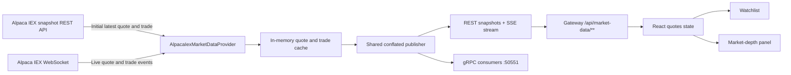

# Emporia and Alpaca IEX market-data flow

This document describes the Alpaca source in Emporia's complete market-data
service. The same service can use deterministic simulated data or direct FIX
simulator streams, aggregate venue books, and distribute continuous updates to
the React workspace and streaming gRPC consumers.

No API keys, API secrets, bearer tokens, or session cookies belong in this
directory.

## Runtime flow



The service subscribes to symbols as they are requested. If the in-memory cache
does not yet contain a quote, it calls the snapshot endpoint to seed the latest
trade and quote. Later WebSocket events update the same cache.

## External Alpaca endpoints

| Purpose | Endpoint |
|---|---|
| Live free IEX stream | `wss://stream.data.alpaca.markets/v2/iex` |
| Initial multi-symbol snapshot | `https://data.alpaca.markets/v2/stocks/snapshots?symbols=...&feed=iex` |
| Paper accounts and orders | `https://paper-api.alpaca.markets/v2` |

The paper-trading REST endpoint is not a market-data endpoint. Emporia's
market-data service uses the first two endpoints.

Alpaca documentation:

- [Streaming market data](https://docs.alpaca.markets/us/docs/streaming-market-data)
- [Stock snapshots](https://docs.alpaca.markets/us/reference/stocksnapshots-1)
- [Real-time stock message schemas](https://docs.alpaca.markets/us/v1.4.2/docs/real-time-stock-pricing-data)

## Example Alpaca payload

This shortened AAPL snapshot was captured on July 23, 2026. Values are examples
and will change with the market.

```json
{
  "latestQuote": {
    "ap": 320.91,
    "as": 80,
    "ax": "V",
    "bp": 320.02,
    "bs": 80,
    "bx": "V",
    "t": "2026-07-23T13:44:57.458159907Z"
  },
  "latestTrade": {
    "p": 320.84,
    "s": 50,
    "x": "V",
    "t": "2026-07-23T13:44:55.038077138Z"
  }
}
```

Relevant Alpaca fields:

| Field | Meaning |
|---|---|
| `bp`, `ap` | Best bid and ask price |
| `bs`, `as` | Best bid and ask size in round lots |
| `bx`, `ax` | Bid and ask exchange code |
| `p`, `s` | Latest trade price and share quantity |
| `t` | Event timestamp |
| `V` | Investors Exchange (IEX) |

## Backend transformation

Emporia transforms Alpaca's compact schema into its stable `Quote` response:

```json
{
  "listingId": 1,
  "symbol": "AAPL",
  "currency": "USD",
  "lastPrice": 320.54,
  "lastQuantity": 40,
  "previousClose": 233.92,
  "change": 86.62,
  "changePercent": 37.03,
  "tradedVolume": 123635,
  "bids": [
    {
      "price": 320.02,
      "size": 8000,
      "exchangeMic": "IEXG"
    }
  ],
  "offers": [
    {
      "price": 320.58,
      "size": 4000,
      "exchangeMic": "IEXG"
    }
  ],
  "asOf": "2026-07-23T13:45:52.505892196Z",
  "source": "ALPACA_IEX"
}
```

The example backend payload was captured after the raw example, so some prices,
sizes, and timestamps reflect newer WebSocket events.

### Field mapping

| Alpaca | Emporia backend | Frontend display |
|---|---|---|
| Quote `bp` | `bids[0].price` | Watchlist bid and depth bid |
| Quote `bs × 100` | `bids[0].size` | Depth bid size |
| Quote `ap` | `offers[0].price` | Watchlist ask and depth ask |
| Quote `as × 100` | `offers[0].size` | Depth ask size |
| Trade `p` | `lastPrice` | Watchlist last and security price |
| Trade `s` | `lastQuantity` | Last size |
| Event `t` | `asOf` | Updated time |
| Exchange `V` | `IEXG` | Venue |
| Provider identity | `source=ALPACA_IEX` | Alpaca IEX data note |

Alpaca represents stock quote sizes in round lots. The provider multiplies
quote sizes by 100 to expose share quantities. Trade sizes are already share
quantities and are not multiplied.

## Emporia APIs

Browser requests go through the frontend proxy and gateway:

```http
GET http://localhost:3001/api/market-data/quotes?listingIds=1,2,3,4
Authorization: Bearer <emporia-access-token>
Accept: application/json
```

The gateway forwards this to the market-data service on port `8084`:

```http
GET /market-data/quotes?listingIds=1,2,3,4
```

The controller removes duplicate IDs and limits a snapshot batch to 50
listings. The market-data service retrieves listing metadata, preserves the
requested order, and delegates quote creation to the configured provider.

The browser's primary interface is the continuous SSE stream:

```http
GET /api/market-data/stream?listingIds=1,2,3,4
Authorization: Bearer <emporia-access-token>
Accept: text/event-stream
```

Each `quote` event contains the same `Quote` model as the REST endpoints. A
single publisher shares provider snapshots across subscribers. Each subscriber
retains only the newest pending update per listing, unchanged data is
suppressed between heartbeats, and the stream reconnect delay is one second.

The service also exposes the `marketdataservice.MarketDataService` protobuf
interface on port `50551`. `Connect` opens the quote stream and `Subscribe`
adds a listing.

## Frontend rendering

The React workspace opens the authenticated SSE stream, reconnects it after a
failure, and stores the latest quote by `listingId`. It does not poll every
three seconds.

The watchlist shows:

- `bids[0].price` as Bid
- `offers[0].price` as Ask
- `lastPrice` as Last
- `changePercent` below Last

The depth panel shows the available bid and offer levels, sizes, spread,
previous close, last size, observed volume, and update time. An IEX book can be
one-sided. The UI displays an em dash for a missing side and `N/A` for a spread
that cannot be calculated. `streamInterrupted` is surfaced explicitly so a
cached price is not silently presented as live.

## Configuration

Select Alpaca IEX mode with process environment variables:

```bash
MARKET_DATA_PROVIDER=alpaca-iex
APCA_API_KEY_ID=<alpaca-key-id>
APCA_API_SECRET_KEY=<alpaca-secret>
```

Optional settings:

| Variable | Default |
|---|---|
| `ALPACA_WEBSOCKET_URL` | `wss://stream.data.alpaca.markets/v2/iex` |
| `ALPACA_SNAPSHOTS_URL` | `https://data.alpaca.markets/v2/stocks/snapshots` |
| `ALPACA_INITIAL_DATA_TIMEOUT` | `5s` |
| `ALPACA_RECONNECT_DELAY` | `5s` |
| `ALPACA_MAX_SYMBOLS` | `30` |

Provider-independent streaming settings are
`MARKET_DATA_PUBLISH_INTERVAL` (default `250ms`) and
`MARKET_DATA_HEARTBEAT_INTERVAL` (default `5s`). The compatible gRPC server is
controlled by `MARKET_DATA_GRPC_ENABLED` and `MARKET_DATA_GRPC_PORT`.

Credentials are read from the market-data JVM's environment. They are not
persisted by Emporia in PostgreSQL, Docker, or `application.yml`. Production
deployments should inject them from a secret manager.

## Data semantics and limitations

- Free IEX data covers one exchange, not the consolidated SIP market.
- IEX supplies one real top-of-book level rather than the simulator's five
  generated levels.
- A quote may have only a bid or only an offer. Emporia does not fabricate the
  missing side.
- `tradedVolume` is volume observed from WebSocket trades since the service
  subscribed. It is not consolidated daily volume.
- `previousClose` currently comes from Emporia static data. Consequently,
  `change` and `changePercent` can be inaccurate when that reference value is
  stale or differs from Alpaca's previous daily bar.
- The backend returns HTTP `503` only when neither the snapshot API nor the
  WebSocket supplies an initial quote before the configured timeout.

These are limitations of the free Alpaca IEX source, not of Emporia's quote
model. The `fix-simulator` provider supports multi-level incremental books.
An `XOSR` composite listing combines all same-symbol venue listings and retains
the source MIC, entry ID, and listing ID on every level.

## Implementation

- Backend provider:
  [`AlpacaIexMarketDataProvider.java`](../../market-data-service/src/main/java/com/emporia/marketdata/AlpacaIexMarketDataProvider.java)
- Backend controller:
  [`MarketDataController.java`](../../market-data-service/src/main/java/com/emporia/marketdata/MarketDataController.java)
- Shared stream:
  [`MarketDataStreamService.java`](../../market-data-service/src/main/java/com/emporia/marketdata/MarketDataStreamService.java)
- FIX simulator provider:
  [`FixSimulatorMarketDataProvider.java`](../../market-data-service/src/main/java/com/emporia/marketdata/FixSimulatorMarketDataProvider.java)
- gRPC endpoint:
  [`GrpcMarketDataService.java`](../../market-data-service/src/main/java/com/emporia/marketdata/GrpcMarketDataService.java)
- Frontend API client:
  [`api.ts`](../../frontend/src/trading/api.ts)
- Frontend workspace:
  [`TradingWorkspacePage.tsx`](../../frontend/src/components/TradingWorkspacePage.tsx)
- Tests:
  [`market-data-service tests`](../../market-data-service/src/test/java/com/emporia/marketdata)

## Verification

Check service health:

```bash
curl http://localhost:8084/actuator/health
```

Run the market-data tests:

```bash
mvn -f emporia/pom.xml -pl market-data-service -am test
```

Generate the JaCoCo coverage report:

```bash
mvn -f emporia/pom.xml -pl market-data-service -am \
  test org.jacoco:jacoco-maven-plugin:0.8.15:report
```

Open the generated HTML report at
`emporia/market-data-service/target/site/jacoco/index.html`.
JaCoCo also writes XML and CSV reports to the same directory.

Run only the Cucumber market-data scenarios:

```bash
mvn -f emporia/pom.xml -pl market-data-service -am \
  -Dtest=RunCucumberTest -Dsurefire.failIfNoSpecifiedTests=false test
```

The feature file is located at
`market-data-service/src/test/resources/features/alpaca_iex_market_data.feature`.

The test suite covers service delegation, controller snapshots and SSE,
subscriber conflation, venue aggregation, protobuf conversion and gRPC
semantics, direct FIX subscriptions and incremental changes, simulated depth,
Alpaca WebSocket messages, one-sided IEX books, snapshot authentication and
parsing, symbol limits, unavailable data, and credential validation.

Operational configuration is collected in the
[market-data service runbook](../../market-data-service/README.md).
